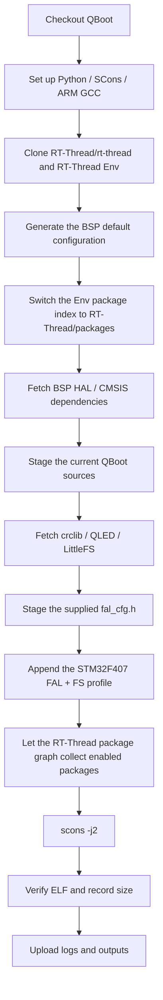

[中文](../zh/ci.md)

# Continuous Integration (CI)

This document describes the repository's RT-Thread target integration build, dependency source policy, configuration scope, build evidence, and validation boundary.

## 1. Validation goal

CI places the current QBoot sources in a real RT-Thread STM32 BSP package graph and compiles and links them with ARM GCC and SCons. The profile is derived from the QBoot portion of the provided STM32F407 configuration and covers mixed FAL/filesystem storage, Update Manager, the shell reason command, status LED support, CRC, and LittleFS.

This is a target integration build, not a target-board runtime test. Flash layout, the `/flash` mount, external NOR flash, the LED pin, and application jumping still require hardware validation.

## 2. Triggers

Workflow: [`../../.github/workflows/ci.yml`](../../.github/workflows/ci.yml)

It runs for pull requests to `main`, pushes to `main`, and manual `workflow_dispatch` runs. The workflow uses only `contents: read` and cancels obsolete runs for the same ref.

## 3. Fixed build environment

- Runner: `ubuntu-22.04`
- Python: `3.11`
- SCons: `4.8.1`
- ARM GCC: `10.3-2021.10`
- RT-Thread: `RT-Thread/rt-thread:master`
- RT-Thread Env: `RT-Thread/env:master`
- RT-Thread package index: `RT-Thread/packages:master`
- BSP: `bsp/stm32/stm32f407-atk-explorer`
- crclib: `qiyongzhong0/crclib:v1.02`
- QLED: `qiyongzhong0/rt-thread-qled:master`
- LittleFS: `RT-Thread-packages/littlefs:master`

Pinned Python dependencies are in [`../../.github/ci/qboot/requirements.txt`](../../.github/ci/qboot/requirements.txt). [`../../.github/actions/setup-rtthread/action.yml`](../../.github/actions/setup-rtthread/action.yml) prepares the toolchain.

## 4. GitHub dependency source policy

CI uses the official RT-Thread repositories for RT-Thread-maintained dependencies:

1. use `RT-Thread/rt-thread:master` for RT-Thread;
2. use `RT-Thread/packages:master` for the RT-Thread package index;
3. use `RT-Thread-packages/littlefs:master` for LittleFS;
4. use the package-index upstream repository and explicit ref for third-party packages such as crclib and QLED;
5. do not guess when a repository or ref cannot be determined from repository/package metadata.

## 5. CI files

- [`../../.github/workflows/ci.yml`](../../.github/workflows/ci.yml): triggers, repository/ref selection, job configuration, and artifact upload.
- [`../../.github/actions/setup-rtthread/action.yml`](../../.github/actions/setup-rtthread/action.yml): pinned Python dependencies and cached ARM GCC.
- [`../../.github/ci/qboot/build-stm32f407-fal-fs.sh`](../../.github/ci/qboot/build-stm32f407-fal-fs.sh): BSP preparation, package-index selection, dependency checkout, QBoot staging, SCons build, and evidence collection.
- [`../../.github/ci/qboot/profiles/stm32f407-fal-fs.h`](../../.github/ci/qboot/profiles/stm32f407-fal-fs.h): QBoot/FAL/FS profile derived from the reference configuration.
- [`../../.github/ci/qboot/profiles/fal_cfg.h`](../../.github/ci/qboot/profiles/fal_cfg.h): STM32F407 FAL device and partition table used by CI.
- [`../../.github/ci/qboot/requirements.txt`](../../.github/ci/qboot/requirements.txt): pinned Python build dependencies.

## 6. Build flow

The script does not manually inject QBoot or crclib `SConscript` files into the BSP `SConstruct`. RT-Thread already collects enabled packages through its package graph; adding them again compiles the same objects twice and causes linker `multiple definition` errors.

## 7. Configuration scope

`stm32f407-fal-fs.h` extracts the QBoot-relevant part of the supplied STM32F407 `rtconfig.h`:

- FAL and filesystem package sources;
- FAL-backed APP storage and filesystem-backed DOWNLOAD/FACTORY storage;
- download, signature, and factory file paths under `/flash`;
- CRC8/CRC16/CRC32 with crclib `v1.02`;
- Update Manager and its download/sign helper;
- the shell reason command;
- QLED status indication;
- LittleFS as the filesystem provider.

The supplied `fal_cfg.h` is used directly for the CI target: internal Flash is represented by the 16K/64K/128K FAL devices, external NOR uses `nor_flash0`, and the table defines `app`, `filesystem`, and `cmb_log` partitions.

On the current `RT-Thread/rt-thread:master` `stm32f407-atk-explorer` BSP, `board/ports/fal` is added to the include path only when `BSP_USING_SPI_FLASH_LITTLEFS` is enabled. CI therefore enables that current BSP symbol together with `FAL_USING_SFUD_PORT`, `BSP_USING_ON_CHIP_FLASH`, and `BSP_USING_SPI_FLASH` so the supplied `fal_cfg.h` can be compiled against the current master BSP.

The profile intentionally does not copy product-board UART, CAN, AT24CXX, SPI/I2C DMA, or other BSP-private hardware settings that are unrelated to QBoot package compilation. This keeps the feature combination representative without claiming that the ATK Explorer BSP is the production board.

## 8. Build evidence

CI attempts to upload evidence even on failures:

- `_ci/logs/stm32f407-fal-fs.log`;
- `_ci/artifacts/stm32f407-fal-fs/effective-config.txt`;
- `_ci/artifacts/stm32f407-fal-fs/size.txt`;
- `_ci/artifacts/stm32f407-fal-fs/rt-thread*.elf`;
- `_ci/artifacts/stm32f407-fal-fs/rt-thread*.map` when generated.

The artifact is named `stm32f407-fal-fs-<commit-sha>` and is retained for 14 days.

## 9. Failure triage

For package download failures, inspect the repository URL, ref, and recorded SHA first. Official RT-Thread sources must not silently fall back to user forks or alternate repositories.

For `multiple definition`, check whether the same package appears once under `build/packages/...` and again under `packages/...`; package `SConscript` files must not be injected twice.

For missing headers or symbols, compare `effective-config.txt` with the dependency checkout records before deciding whether the profile, dependency acquisition, or QBoot conditional compilation is at fault.

A successful SCons command is not sufficient by itself: the job also requires a real `rt-thread*.elf` output.

## 10. Not covered yet

The current CI does not validate the complete product-board UART/CAN/I2C/SPI/AT24CXX configuration, runtime correctness of the supplied FAL partition layout, SFUD initialization, `/flash` mounting, runtime update/recovery behavior, application jumping, host unit tests, QEMU/HIL, or an RT-Thread version matrix.
