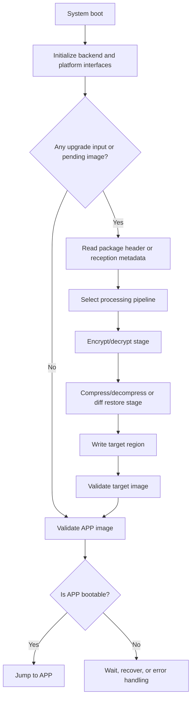

# QBoot Overview

## 1. What QBoot is

QBoot is a componentized implementation for bootloader projects. It splits firmware reception, firmware processing, firmware release, image validation, and jump-to-application logic into configurable modules.

It is not a single fixed solution. It is a trimmable and extensible framework. You can keep only the smallest working path, or extend it with compression, encryption, differential update, an upgrade reception state machine, and product-specific logic.

## 2. Core capabilities

### 2.1 Storage backends
QBoot does not force a single storage model. Common options are:

- **FAL** for partition-managed RT-Thread projects
- **FS** for file-based package and image storage
- **CUSTOM** for direct integration with private flash drivers, external storage, or mixed layouts

### 2.2 Firmware processing capabilities
Enable only what you need:

- firmware encryption / decryption
- firmware compression / decompression
- differential update
- package validity checks
- target-region verification after release

### 2.3 Workflow and extension capabilities
Optional features include:

- upgrade reception workflow
- shell commands
- status LED
- recovery key
- product-code validation
- product information output
- multi-MCU integration interfaces
- weak/custom extension points

## 3. Typical logical roles

Common logical roles in QBoot are:

- **APP**: final runtime image region
- **DOWNLOAD**: staging region for package or patch reception
- **FACTORY**: fallback or recovery image region
- **SWAP**: helper region for diff update in selected strategies

These roles are not mandatory and do not need to exist together in every design.

## 4. Typical processing flow

This is a logical flow, not the only implementation. Upgrade input, storage backend, image validation policy, and pre-jump cleanup are all replaceable.

## 5. Suitable scenarios

QBoot is a good fit for projects that need:

- a trimmable bootloader capability set for MCU products
- selective use of full-image update, compressed update, encrypted update, or differential update
- integration with on-chip flash, external flash, filesystem storage, or a custom backend
- product-level extension points without hard-coding every behavior into the core bootloader
- a path that starts from a minimal version and grows toward a fuller upgrade solution

## 6. Integration suggestions

### 6.1 Minimal working version
Start with:

- one working storage backend
- one APP target region
- one working reception or write path
- basic image validation
- jump to APP

### 6.2 Regular upgrade version
Then add as needed:

- DOWNLOAD region
- upgrade reception workflow
- compression or decryption
- product-code validation
- status indication and recovery entry

### 6.3 Differential update version
Requires extra attention to:

- patch generation flow
- read/write conflict between old image and new image
- RAM buffer or SWAP planning
- erase granularity and write atomicity

## 7. Documentation map

If you want a single page that explains what each document is for, read [Documentation Map](document-map.md).

## 8. What to read next

- First integration: [Quick Start](quick-start.md)
- Feature combination: [Configuration Guide](configuration.md)
- Upgrade state machine: [Upgrade Reception Workflow](update-manager.md)
- Differential OTA: [HPatchLite Differential OTA](differential-ota-hpatchlite.md)
- Packaging side usage: [Tools and Packaging](tools.md)
