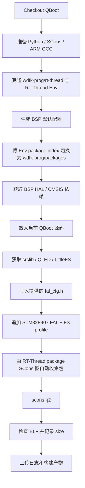

[English](../en/ci.md)

# 持续集成（CI）

本文档说明仓库 GitHub Actions 的 RT-Thread 目标平台集成编译、依赖来源策略、配置范围、构建证据和验证边界。

## 1. 验证目标

CI 将当前 QBoot 源码放入真实 RT-Thread STM32 BSP 的 package 构建图，并使用 ARM GCC 与 SCons 完成编译和链接。当前 profile 以实际 STM32F407 配置中的 QBoot 部分为基线，覆盖 FAL + 文件系统混合存储、Update Manager、Shell reason 命令、状态灯、CRC 和 LittleFS。

该检查属于目标平台集成编译验证，不等价于目标板运行测试。Flash 分区布局、`/flash` 挂载、外部 NOR Flash、状态灯引脚和 APP 跳转仍需要目标板验证。

## 2. 触发条件

工作流文件：[`../../.github/workflows/ci.yml`](../../.github/workflows/ci.yml)

工作流在以下场景运行：

- 向 `main` 提交 Pull Request；
- 直接推送到 `main`；
- 通过 `workflow_dispatch` 手动触发。

工作流仅授予 `contents: read`，并取消同一引用上已过时的运行。

## 3. 固定构建环境

- Runner：`ubuntu-22.04`
- Python：`3.11`
- SCons：`4.8.1`
- ARM GCC：`10.3-2021.10`
- RT-Thread：`wdfk-prog/rt-thread:master`
- RT-Thread Env：`RT-Thread/env:master`
- RT-Thread package index：`wdfk-prog/packages:master`
- BSP：`bsp/stm32/stm32f407-atk-explorer`
- crclib：`qiyongzhong0/crclib:v1.02`
- QLED：`qiyongzhong0/rt-thread-qled:master`
- LittleFS：`wdfk-prog/littlefs:master`

Python 依赖固定在 [`../../.github/ci/qboot/requirements.txt`](../../.github/ci/qboot/requirements.txt)，工具链环境由 [`../../.github/actions/setup-rtthread/action.yml`](../../.github/actions/setup-rtthread/action.yml) 准备。

## 4. GitHub 依赖来源规则

CI 对 GitHub 源码依赖采用以下顺序：

1. 用户账号 `wdfk-prog` 下存在对应仓库时，优先使用该仓库；
2. 用户账号下不存在时，使用 RT-Thread package index 中记录的上游仓库；
3. 版本明确时固定到对应 tag；`latest` 按 package 元数据使用 `master`；
4. 无法从仓库或 package 元数据确定仓库/分支时，不猜测来源，应先确认后再修改 CI。

因此 RT-Thread、package index 和 LittleFS 使用 `wdfk-prog` 仓库；当前账号没有 crclib 与 QLED fork，所以两者使用 package 元数据中的上游地址。

## 5. CI 文件职责

- [`../../.github/workflows/ci.yml`](../../.github/workflows/ci.yml)：触发规则、仓库/分支来源、任务和 artifact 上传。
- [`../../.github/actions/setup-rtthread/action.yml`](../../.github/actions/setup-rtthread/action.yml)：安装 Python 依赖并缓存固定 ARM GCC。
- [`../../.github/ci/qboot/build-stm32f407-fal-fs.sh`](../../.github/ci/qboot/build-stm32f407-fal-fs.sh)：准备 BSP、切换 package index、获取依赖、放入当前 QBoot、执行 SCons 并收集证据。
- [`../../.github/ci/qboot/profiles/stm32f407-fal-fs.h`](../../.github/ci/qboot/profiles/stm32f407-fal-fs.h)：保存从实际配置提取的 QBoot/FAL/FS 编译 profile。
- [`../../.github/ci/qboot/profiles/fal_cfg.h`](../../.github/ci/qboot/profiles/fal_cfg.h)：保存 CI 使用的 STM32F407 FAL 设备表和分区表。
- [`../../.github/ci/qboot/requirements.txt`](../../.github/ci/qboot/requirements.txt)：固定 Python 构建依赖。

## 6. 构建流程

脚本不再向 BSP `SConstruct` 手工追加 QBoot 或 crclib `SConscript`。RT-Thread 已经会通过 package 构建图收集启用的软件包；重复手工加入会导致同一对象编译两次并在链接阶段产生 `multiple definition`。

## 7. 配置范围

`stm32f407-fal-fs.h` 从提供的 STM32F407 `rtconfig.h` 中提取与 QBoot 集成直接相关的配置，重点覆盖：

- `QBOOT_PKG_SOURCE_FAL` 与 `QBOOT_PKG_SOURCE_FS`；
- APP 使用 FAL，DOWNLOAD/FACTORY 使用文件系统；
- `/flash/download.rbl`、签名文件和 factory 文件路径；
- CRC8、CRC16、CRC32，crclib 固定 `v1.02`；
- `QBOOT_USING_UPDATE_MGR` 及 download/sign helper；
- Shell reason 命令；
- QLED 状态灯；
- LittleFS 文件系统 provider。

`fal_cfg.h` 使用提供的 STM32F407 配置：片内 Flash 由 16K/64K/128K 三类 FAL 设备组成，外部 NOR 使用 `nor_flash0`，并定义 `app`、`filesystem`、`cmb_log` 三个分区。

当前 `wdfk-prog/rt-thread:master` 的 `stm32f407-atk-explorer` 只有在 `BSP_USING_SPI_FLASH_LITTLEFS` 打开时才把 `board/ports/fal` 加入头文件搜索路径并编译对应 FAL port。因此 CI 显式启用该当前 BSP 符号，同时启用 `FAL_USING_SFUD_PORT`、`BSP_USING_ON_CHIP_FLASH`、`BSP_USING_SPI_FLASH` 等依赖，使提供的 `fal_cfg.h` 在当前 master BSP 上可编译。

profile 不复制 UART、CAN、AT24CXX、SPI/I2C DMA 等与 QBoot package 编译无直接关系的产品板硬件配置。这样可以验证 QBoot 的真实功能组合，同时避免把某一块产品板的 BSP 私有硬件定义伪装成 `stm32f407-atk-explorer` 的运行配置。

## 8. 构建证据

CI 始终尝试上传以下内容，失败时也保留可用证据：

- `_ci/logs/stm32f407-fal-fs.log`：完整步骤和构建日志；
- `_ci/artifacts/stm32f407-fal-fs/effective-config.txt`：实际生效的 QBoot、存储、CRC 和 package 宏；
- `_ci/artifacts/stm32f407-fal-fs/size.txt`：`arm-none-eabi-size` 输出；
- `_ci/artifacts/stm32f407-fal-fs/rt-thread*.elf`：成功构建的 ELF；
- `_ci/artifacts/stm32f407-fal-fs/rt-thread*.map`：BSP 生成 map 时一并保存。

artifact 名称为 `stm32f407-fal-fs-<commit-sha>`，保存 14 天。

## 9. 失败定位

### package 获取失败

先查看日志中记录的仓库 URL、ref 和 SHA。用户 fork 存在时不应静默回退到另一个仓库；上游依赖的版本必须与 package 元数据一致。

### `multiple definition`

先检查同一包是否同时出现 `build/packages/...` 与 `packages/...` 两组对象。CI 不应再手工向 BSP `SConstruct` 注入 package `SConscript`。

### 缺少头文件或符号

先检查 `effective-config.txt` 与依赖 clone 记录，再判断是 profile 未启用所需能力、依赖未获取，还是当前 QBoot 源码自身的条件编译问题。

### 没有生成 ELF

SCons 成功后仍必须实际找到 `rt-thread*.elf`；否则任务判定失败。

## 10. 当前未覆盖范围

当前 CI 不验证：

- 产品板 UART/CAN/I2C/SPI/AT24CXX 等完整 BSP 配置；
- 提供的 FAL 分区表在产品硬件上的运行有效性、SFUD 外部 Flash 初始化和 `/flash` 挂载；
- 固件下载、断电恢复、Factory 恢复和 APP 跳转运行行为；
- Host 单元测试、QEMU、HIL 和多 RT-Thread 版本矩阵。
