# QBoot 最小化配置示例

## 1. 文档目标

本页展示的是：在不预设完整产品功能的前提下，如何把 QBoot 裁剪到一个容易落地、容易验证、容易继续扩展的最小配置。

这里的“最小化”不是固定模板，而是一种配置方法：先保留必须项，再逐步添加算法、接收流程和产品功能。

## 2. 适用思路

适合以下类型的起步方式：

- 先需要一个能写入、校验、跳转的基础版本
- 希望先验证存储后端和跳转逻辑
- 计划后续再叠加压缩、加密、差分升级或恢复策略

## 3. 最小化原则

### 必留
- QBoot 核心模块
- 一个可工作的后端
- APP 目标区
- 基础镜像校验
- MCU 跳转接口

### 首版通常先关闭
- 差分升级
- 大型压缩算法
- 升级接收流程框架
- Shell 与调试辅助能力
- 状态灯和恢复按键

## 4. 建议步骤

1. 先让 bootloader 工程单独编译通过
2. 接入一个后端并确认擦写正确
3. 只保留 APP 目标区和最基本固件输入
4. 跑通镜像写入、校验和跳转
5. 再按需加入 DOWNLOAD、FACTORY、差分升级或恢复逻辑

## 5. 后端选择建议

### 5.1 选 FAL
适合已有分区表的 RT-Thread 工程。

### 5.2 选 CUSTOM
适合已有私有存储抽象或不希望依赖 FAL 的工程。

### 5.3 选 FS
适合通过文件接收和管理升级镜像的工程。

## 6. 算法建议

最小化配置首次建议：

- 不启用算法链路，先跑通主流程
- 若必须启用压缩，优先考虑轻量方案
- 差分升级留到主流程稳定后再接入

## 7. 验证重点

最小化版本至少要验证：

- 固件输入能被读到
- 目标区能被正确擦写
- 镜像校验结果可信
- 跳转逻辑适配当前 MCU

## 8. 扩展顺序建议

推荐的扩展顺序：

1. 先加 DOWNLOAD 区
2. 再加升级接收流程框架
3. 再加压缩或加密
4. 最后评估差分升级与恢复策略

## 8. 图示裁剪示例

下面保留上游“极简版 Bootloader”相关截图，用来辅助理解一个最小可工作配置是怎样逐步裁剪出来的。这里的截图是示例路径，不代表这些选项必须全部固定不变。

### 8.1 建立最小工程基线

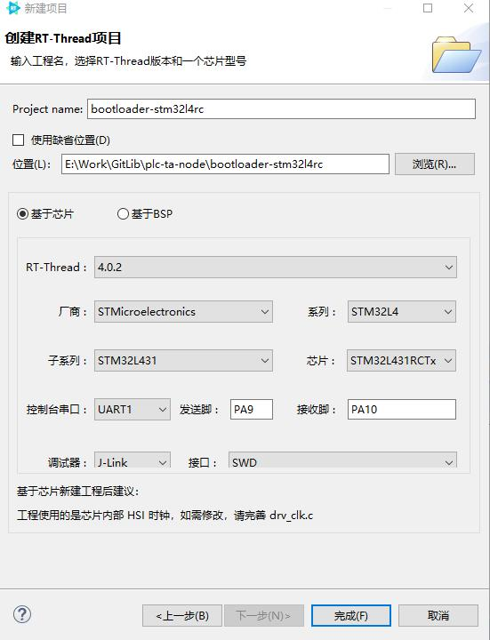

### 8.2 保留最基本的软件包与平台配置

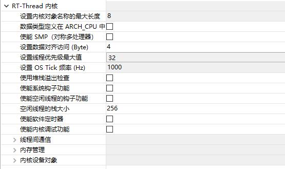

### 8.3 精简不必要组件

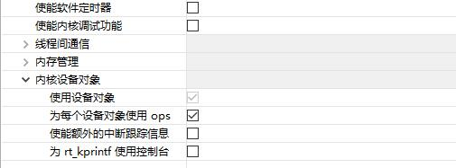

### 8.4 配置最小后端路径

### 8.5 保留 APP 目标区

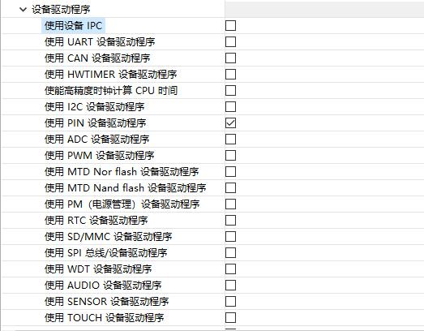

### 8.6 关闭非必需能力

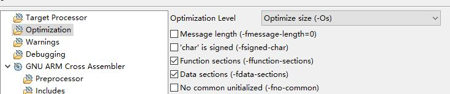

### 8.7 关闭附加算法或高级能力

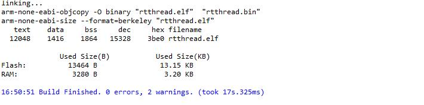

### 8.8 检查生成的最小配置

### 8.9 准备编译与链接验证

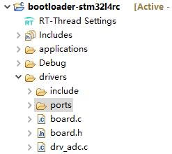

### 8.10 观察编译结果

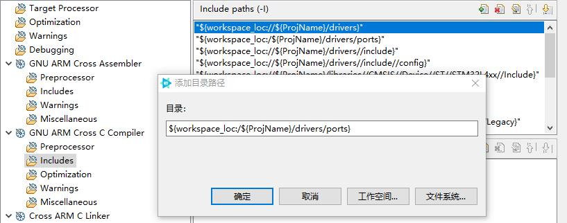

### 8.11 检查镜像输出

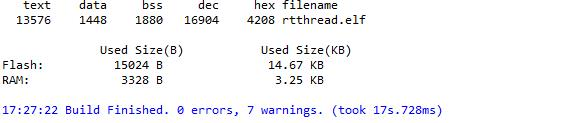

### 8.12 准备最小升级输入

### 8.13 写入并验证基础升级路径

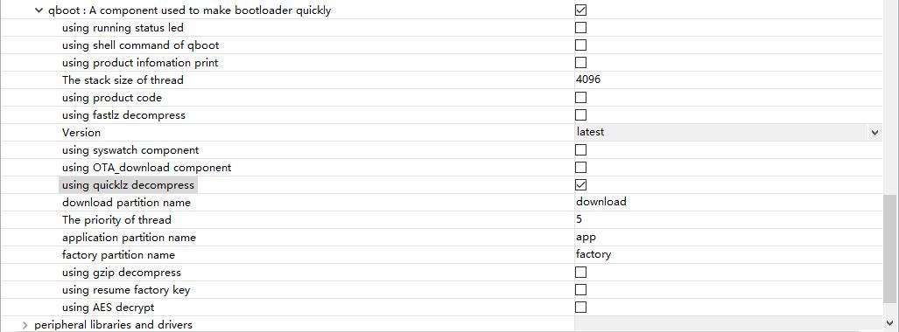

### 8.14 检查目标区结果

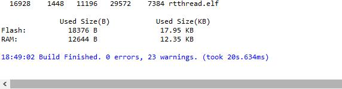

### 8.15 验证合法性检查路径

### 8.16 验证跳转前状态

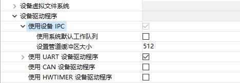

### 8.17 验证 APP 跳转结果

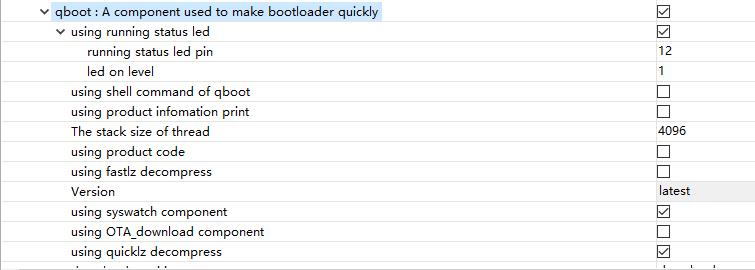

### 8.18 观察最小化配置的运行结果

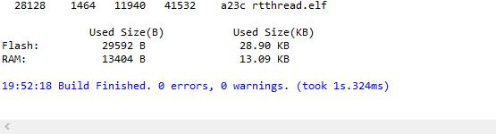

### 8.19 评估是否继续增加能力

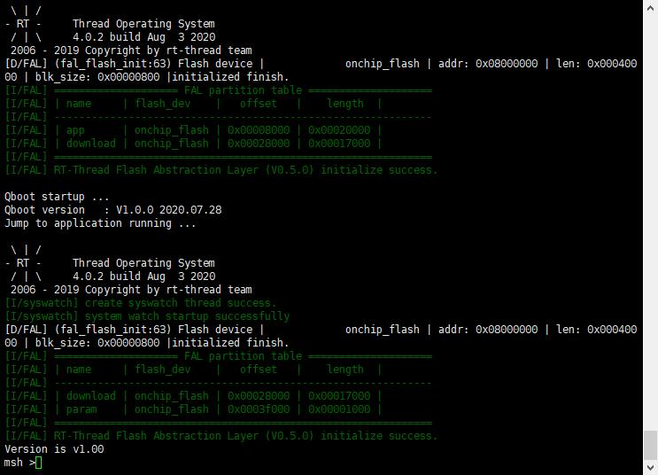

### 8.20 形成后续扩展基线

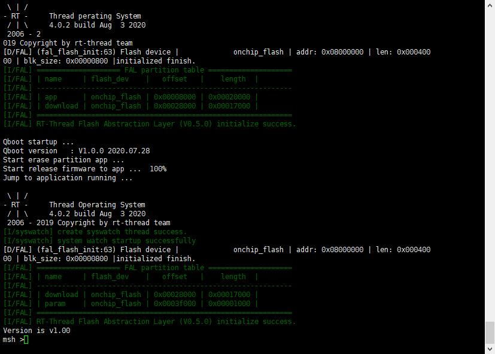