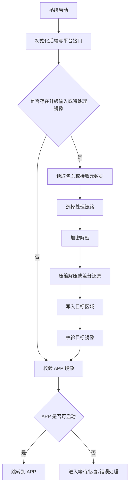

# QBoot 总览

## 1. QBoot 是什么

QBoot 是一套面向 bootloader 场景的组件化实现，负责把固件接收、固件处理、固件释放、镜像校验和应用跳转拆成可配置模块。

它不是单一固定方案，而是一个可裁剪、可扩展的框架。你可以只保留最小可用链路，也可以继续叠加压缩、加密、差分升级、升级接收状态机和产品级扩展逻辑。

## 2. 核心能力

### 2.1 存储后端
QBoot 并不强制绑定某一种底层存储模型。常见方式包括：

- **FAL**：适合已有分区表管理的 RT-Thread 工程
- **FS**：适合把固件包与目标镜像映射为文件的工程
- **CUSTOM**：适合直接对接自定义 Flash、外置存储、私有驱动接口或混合存储布局

### 2.2 固件处理能力
可按需启用：

- 固件加密 / 解密
- 固件压缩 / 解压
- 差分升级
- 固件合法性检查
- 目标区校验与释放完成校验

### 2.3 流程与扩展能力
可按需启用：

- 升级接收流程框架
- Shell 命令
- 状态指示灯
- 恢复按键
- 产品码校验
- 产品信息输出
- 多系列 MCU 跳转与平台对接接口
- weak/custom 扩展点

## 3. 典型角色划分

QBoot 常见会使用这些逻辑角色：

- **APP**：应用镜像最终运行区
- **DOWNLOAD**：接收升级包或差分包的暂存区
- **FACTORY**：保底镜像或恢复镜像区
- **SWAP**：差分升级在特定策略下使用的周转区

这些角色不是强制要求，也不一定必须同时存在。实际工程可以只保留自己需要的角色组合。

## 4. 典型处理流程

上图描述的是逻辑流程，而不是唯一实现。对于不同项目，升级输入、存储后端、镜像校验规则和跳转前收尾动作都可以替换。

## 5. 适合使用的场景

QBoot 适合以下类型的项目：

- 需要为 MCU 产品提供可裁剪 bootloader 能力
- 需要在完整升级、压缩升级、加密升级、差分升级之间按需选择
- 需要对接片上 Flash、外部 Flash、文件系统或自定义存储后端
- 需要保留产品级扩展入口，而不想把所有逻辑都写死在 bootloader 核心里
- 需要从最小版本起步，再逐步叠加升级策略和工程能力

## 6. 集成建议

### 6.1 最小可用版本
建议先跑通：

- 一个可用的存储后端
- APP 目标区
- 一条可工作的固件接收或写入路径
- 基本镜像校验
- 跳转到 APP

### 6.2 常规升级版本
可逐步叠加：

- DOWNLOAD 区
- 升级接收流程框架
- 压缩或解密能力
- 产品码校验
- 状态指示与恢复入口

### 6.3 差分升级版本
需要额外考虑：

- patch 包生成流程
- 旧镜像读取与新镜像写入冲突
- RAM 缓冲或 SWAP 区规划
- 擦除粒度和写入原子性

## 7. 文档地图

如果你希望先看一页“每篇文档分别负责什么”，可直接阅读 [文档地图](document-map.md)。

## 8. 下一步读什么

- 第一次接入：看 [快速开始](quick-start.md)
- 做能力组合：看 [配置指南](configuration.md)
- 需要升级接收状态机：看 [升级接收流程框架](update-manager.md)
- 需要差分升级：看 [HPatchLite 差分升级](differential-ota-hpatchlite.md)
- 需要了解打包侧工具：看 [工具与打包说明](tools.md)
