# QBoot 快速开始

## 1. 目标

本页的目标是：用尽量少的前置假设，把一个空白或近空白的工程整理成**可工作的 bootloader 最小链路**。

这里不预设必须使用片上 Flash、FAL、三段式布局、压缩算法或差分升级；这些都可以在后续按需加入。

## 2. 前置条件

建议至少具备以下条件：

- bootloader 工程可以独立编译与下载
- 已知应用镜像的放置位置和启动地址
- 已准备一种可用的底层存储访问方式
- 已准备一种把升级数据送入 bootloader 的方式

## 3. 第一次接入建议

建议第一次先只保留这几个要素：

- 一个可工作的存储后端：`FAL`、`FS` 或 `CUSTOM` 三选一
- 一个 APP 目标区域
- 一条基本固件输入路径
- 基础镜像校验与跳转流程

这样最容易先把主链路跑通。

## 4. 基础工程准备

### 4.1 保持 `main()` 简洁
bootloader 不需要复杂应用初始化时，`main()` 可以保持最小化，只保留必要初始化与主流程驱动。

### 4.2 准备底层存储接口
你至少需要一种方式去完成：

- 读取固件包或升级数据
- 擦除目标区域
- 写入目标镜像
- 在需要时读取目标镜像头部用于校验和跳转

这组能力可以来自 FAL，也可以来自文件系统，也可以完全由 custom backend 提供。

### 4.3 明确镜像边界
第一次接入前至少明确：

- APP 起始地址或目标位置
- 升级输入区域或输入文件位置
- 擦除粒度
- 镜像最大尺寸

## 5. 选择后端方式

### 5.1 FAL backend
适合已有分区表管理的 RT-Thread 工程。

### 5.2 Filesystem backend
适合升级包通过文件存在本地文件系统中的工程。

### 5.3 Custom backend
适合已有私有 Flash 抽象、外部存储驱动或非标准布局的工程。

## 6. 添加 QBoot 组件

在软件包中心或包管理机制中加入 QBoot，并先只关注：

- 包来源后端配置
- APP 目标区域配置
- 跳转实现是否适配当前 MCU
- 是否启用任何算法处理

## 7. 最小推荐配置

### 必选
- `PKG_USING_QBOOT`
- 一个 package source backend
- 一个 APP store backend

### 首次接入时建议关闭
- AES
- gzip
- HPatchLite
- Shell
- 状态灯
- 恢复按键
- 升级接收流程框架

## 8. 打包与验证

### 8.1 准备升级包
使用仓库 `tools/` 中的打包工具生成 QBoot 可识别的升级包，或使用你自己的接收协议把升级数据写到输入区域。

### 8.2 验证第一次成功条件
第一次跑通时至少确认：

- bootloader 能读到升级输入
- QBoot 能完成固件处理与写入
- APP 镜像通过合法性检查
- 能稳定跳转到 APP

## 8. 图示步骤

下面保留上游接入演示中的关键操作截图，用来辅助理解“从基础工程到可工作 bootloader”的典型接入路径。实际工程不要求完全按截图中的工具、分区方式或目录布局照搬。

### 8.1 创建基础工程

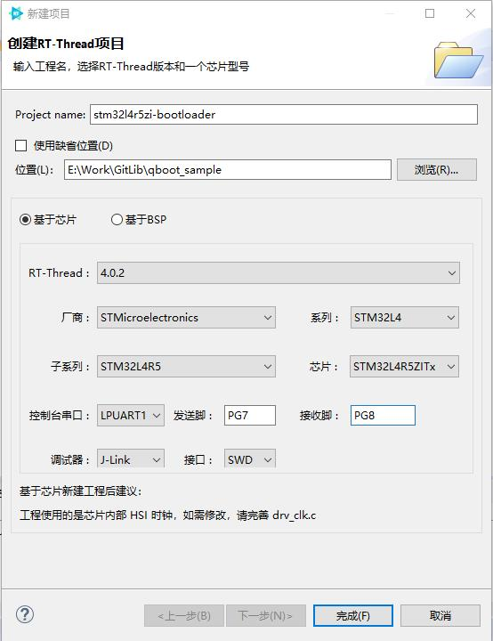

### 8.2 打开软件包并选择 QBoot

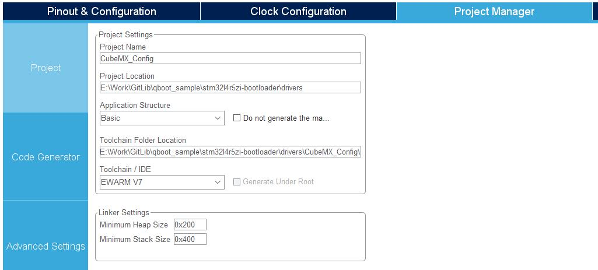

### 8.3 进入 QBoot 配置页面

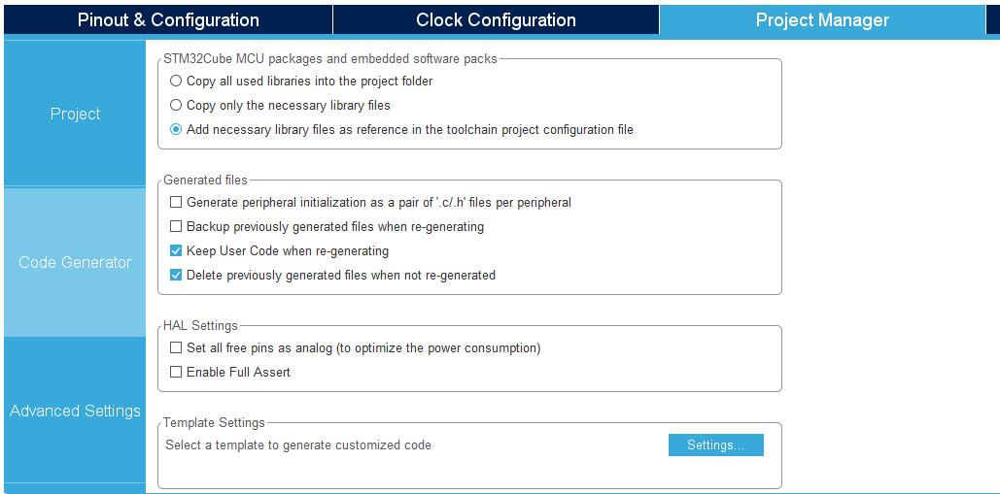

### 8.4 配置基础选项

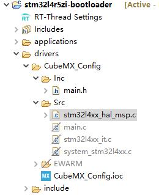

### 8.5 配置存储或分区相关选项

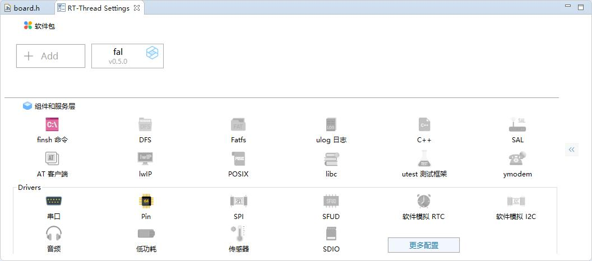

### 8.6 配置应用区与升级输入区

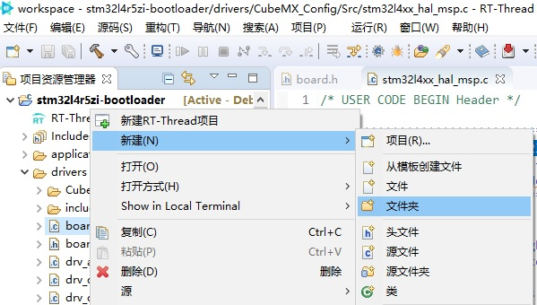

### 8.7 配置算法或处理链路

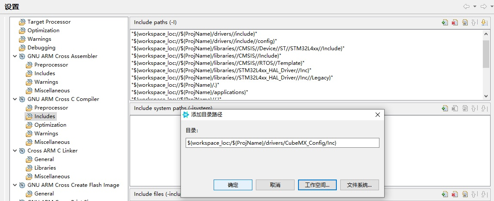

### 8.8 生成工程并检查组件接入结果

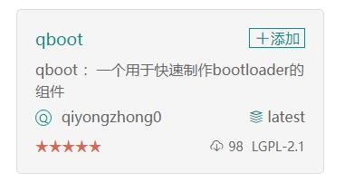

### 8.9 准备打包工具或升级输入

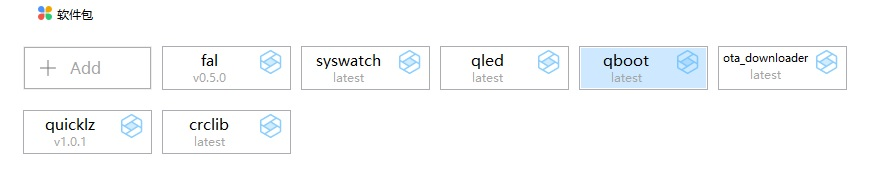

### 8.10 下载验证并观察启动路径

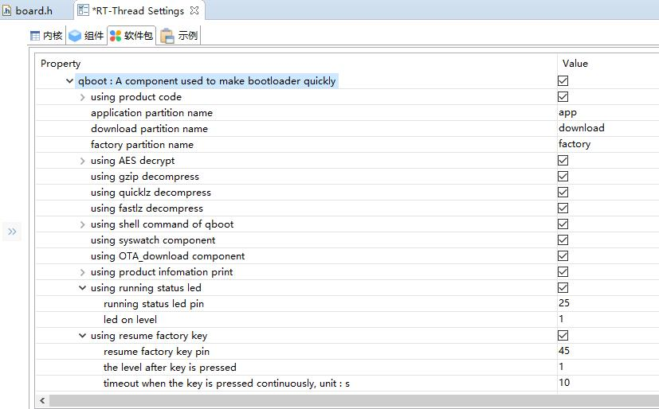

### 8.11 首次跑通后的结果确认

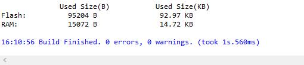

## 9. 常见问题

### 9.1 为什么包被识别不到
常见原因：

- 升级输入区域没有真正写入成功
- 包头位置与读取策略不匹配
- 自定义后端没有正确返回长度、偏移或内容
- 固件目标名、产品码或校验策略拦截了包

### 9.2 为什么释放成功但跳转失败
优先检查：

- `qbt_jump_to_app()` 是否适配当前芯片
- 中断、时钟、缓存、向量表处理是否正确
- APP 链接地址与 bootloader 认知是否一致

### 9.3 为什么 APP 校验失败
优先检查：

- 升级包格式是否正确
- 是否启用了不匹配的算法链路
- 自定义校验逻辑是否比默认流程更严格

## 10. 上游文章关系说明

本页思路参考上游文章 **《基于RT-Thread 4.0快速打造bootloader》**，但这里已按当前工程化目标重新组织：

- 不把 FAL 作为强制前提
- 不把三段式布局作为固定模板
- 不把片上 Flash 作为默认限制
- 不把历史 RT-Thread 版本背景作为正文主线

## 11. 下一步

- 做能力组合：看 [配置指南](configuration.md)
- 做升级接收状态机：看 [升级接收流程框架](update-manager.md)
- 做差分升级：看 [HPatchLite 差分升级](differential-ota-hpatchlite.md)
