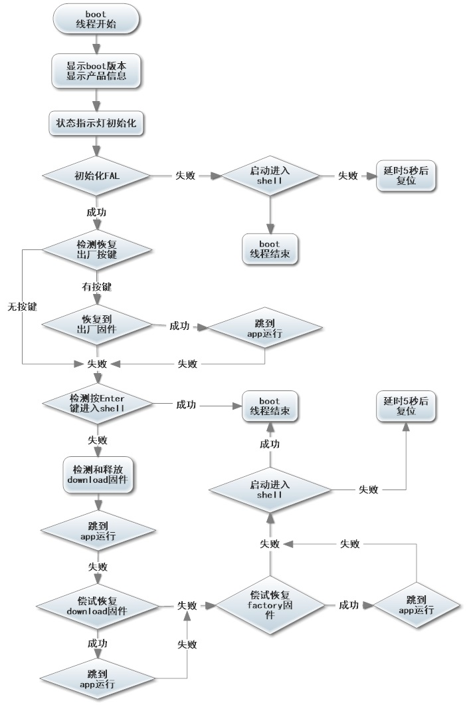

# QBoot 工作流程

## 1. 总体流程

QBoot 的核心工作可以概括为以下步骤：

1. 初始化平台与存储访问能力
2. 初始化算法模块
3. 判断升级原因、下载状态和恢复条件
4. 读取固件包信息
5. 根据算法链执行解密 / 解压 / 差分合成
6. 将结果写入目标区域
7. 对目标固件做合法性验证
8. 满足条件后跳转到 APP

## 2. 总体流程图

## 2. 启动决策

启动阶段最关键的是两个问题：

- 当前是否应该进入升级路径
- 当前是否可以直接跳转 APP

常见判断依据：

- APP 是否有效
- DOWNLOAD 中是否存在可用包
- FACTORY 是否可用于恢复
- 是否存在请求升级的持久化标志

## 3. 固件处理路径

### 3.1 整包路径
适用于普通加密包或压缩包：

- 读包头
- 建立算法上下文
- 流式处理输入数据
- 写入目标区
- 校验目标镜像

### 3.2 差分路径
适用于 HPatchLite：

- 读取 patch
- 读取旧 APP
- 通过 swap 或 RAM buffer 逐步合成新镜像
- 按擦除粒度提交到 APP 区
- 最终完成长度与镜像一致性检查

## 4. 恢复路径

当 APP 无效时，系统可按产品策略尝试：

- 从 DOWNLOAD 释放恢复
- 从 FACTORY 恢复
- 继续等待下载
- 进入错误处理路径

## 5. 建议的调试顺序

调试工作流时，建议按以下顺序排查：

1. 存储后端是否正常
2. 包头是否可正确解析
3. 算法开关是否匹配真实包格式
4. 目标区擦写是否正确
5. APP 校验是否正确
6. 跳转流程是否正确

## 6. 常见失效点

- 分区定义与实际 flash 布局不一致
- 包头位置规则与实际包格式不一致
- 算法配置与打包方式不一致
- 自定义后端擦除对齐错误
- 跳转前平台收尾不完整
